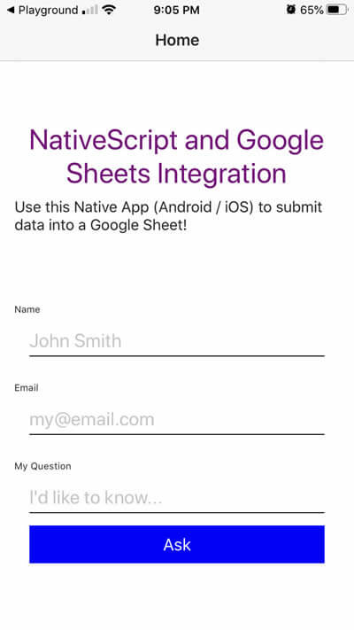

## NativeScript Tutorial to Integrate Google Sheets
I was recently asked to create a Native App (compatible with both Android and iOS) that could submit data into a Google Sheet. 

This tutorial uses NativeScript (with Vanilla JavaScript).

[View the tutorial: https://medium.com/@stevesohcot/nativescript-tutorial-to-integrate-google-sheets-74d51be670b4](https://medium.com/@stevesohcot/nativescript-tutorial-to-integrate-google-sheets-74d51be670b4)

